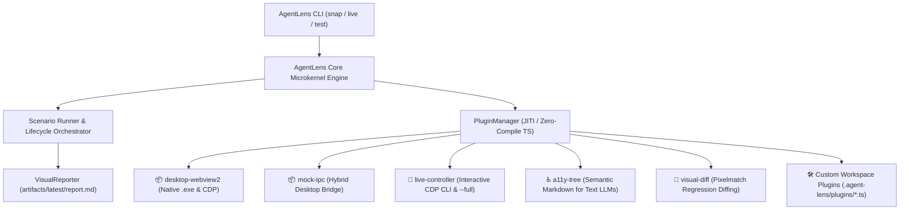

<div align="center">
  <h1>👁️ AgentLens</h1>
  <p><b>Give your AI coding agent eyes and hands.</b></p>
  <p>A Microkernel Agentic UI Platform for visual self-checks, responsive layout verification, interactive live control, accessibility inspection, and pixel regression testing before reporting back to humans.</p>

  [](https://www.npmjs.com/package/@_deep4wee/agent-lens)
  [](https://www.npmjs.com/package/@_deep4wee/agent-lens)
  [](https://github.com/deep4wee/agent-lens/blob/main/LICENSE)
  [](https://www.typescriptlang.org/)
  [](https://playwright.dev/)
</div>

---

## 🤔 The Problem

AI coding agents (such as Cursor, Claude Code, Gemini CLI, or Roo) are remarkably capable at writing code, but they are **blind**. 

When an agent builds or refactors a user interface, it reports *"Done!"*, yet it cannot know if:
- The CSS layout shifted or broke on mobile viewports.
- The modal opened off-screen or clips behind another layer.
- An unhandled JavaScript runtime error or undefined prop crashed the React tree.
- Text-only reasoning models have no structured way to understand the interactive DOM hierarchy.

Humans are forced to manually launch browsers, take screenshots, and tell the agent what to fix.

## 💡 The Solution

**AgentLens** is a visual testing platform built specifically for AI coding agents. It provides a modular **Microkernel architecture** that enables agents to:
1. Write frontend or desktop code.
2. **"See" the result immediately** using one-shot `snap` commands or scripted scenarios.
3. **Interact in real-time** via the persistent `live` controller loop with coordinate clicks and input typing.
4. **"Read" semantic UI hierarchies** using the built-in accessibility tree plugin (essential for text-only LLMs).
5. **Detect pixel-level visual regressions** using automated `pixelmatch` diffing.
6. Intercept silent console crashes, network failures, and runtime exceptions.
7. Author **1-file plugins on-the-fly** to solve project-specific constraints.
8. Self-correct mistakes *before* presenting the final result to the user!

---

## 🏗️ Architecture: The Microkernel Platform

AgentLens separates the core execution engine from drivers, state bridges, and developer tools:



---

## ✨ Features & Official Plugins

- ⚡ **Instant One-Shot Verification (`snap`)**: Verify any live URL across desktop and mobile in seconds without writing test files.
- 📜 **Full-Page Screen Captures (`--full`)**: Capture entire scrollable page heights beyond the default viewport.
- 🚀 **Interactive Live Controller (`live`)**: Persistent background browser session with sub-50ms command execution (`click <x> <y>`, `type <sel> <text>`, `snap --full`, `stop`).
- ♿ **Semantic Accessibility Inspector (`a11y-tree`)**: Extracts clean Markdown accessibility trees (roles, names, states, focus) so text-only LLMs can "read" the UI layout.
- 🎨 **Visual Regression Diffing (`visual-diff`)**: Automated pixel-by-pixel comparisons with baseline images using `pixelmatch` + `pngjs`, generating difference masks (`*_diff.png`) and changed pixel percentages.
- 🖥️ **Native Desktop Testing (`desktop-webview2`)**: Test compiled Windows `.exe` binaries (WebView2 / Electron / Photino) over CDP with process tree management (`treeKill`).
- 📦 **Hybrid IPC Mock Bridge (`mock-ipc`)**: Intercept desktop IPC calls (`window.__mockIpc` and `window.external.sendMessage`) for error boundaries and offline states.
- 🌐 **Network API Route Mocking**: Intercept REST/GraphQL calls (`mockRoutes` / `ctx.setMockRoute`) without backend dependencies.
- 🔴 **Console Crash Tracker**: Intercepts `console.error`, `console.warn`, and unhandled exceptions (`pageerror`) with stack traces.
- 🧹 **Guaranteed Clean Teardown**: Built-in `setup()`, `teardown()`, and `--clean` flags that execute in a `finally` block even if the test fails.
- 🤖 **Agent-First Markdown Reports**: Produces a standardized `artifacts/latest/report.md` formatted for LLM file-reading tools.
- 🔌 **Extensible Plugin System**: Agents can author custom 1-file plugins in `.agent-lens/plugins/` using modern TypeScript without compiling.

---

## 🚀 Quickstart

### 1. Instant One-Shot Check (`snap`)

The fastest way to verify changes without writing any test files:

```bash
# Run directly via npx:
npx @_deep4wee/agent-lens snap --url=http://localhost:5173

# Capture full scrollable page:
npx @_deep4wee/agent-lens snap --url=http://localhost:5173 --full

# Auto-start dev server, wait until ready, snap, and auto-terminate:
npx @_deep4wee/agent-lens snap --start="npm run dev" --url=http://localhost:5173

# Focus on a specific component:
npx @_deep4wee/agent-lens snap --url=http://localhost:5173/settings --selector=".pricing-card"

# Extract semantic accessibility tree during snap:
npx @_deep4wee/agent-lens snap --url=http://localhost:5173 --plugin=a11y-tree
```

---

### 2. Interactive Live Controller Loop (`live`)

Keep a browser running in the background and send commands step-by-step with sub-50ms latency:

```bash
# 1. Start background live session:
npx agent-lens live start --url=http://localhost:5173

# 2. Click coordinates (for Vision AI models) or CSS selectors:
npx agent-lens live click 450 180
npx agent-lens live click "button.open-modal"

# 3. Fill in form fields:
npx agent-lens live type "input[name='email']" "agent@example.com"

# 4. Take live snapshots (updates artifacts/live/current.png):
npx agent-lens live snap step_02 --full

# 5. Stop session when done:
npx agent-lens live stop
```

---

### 3. Scripted Scenarios

Install as a development dependency:
```bash
npm install -D @_deep4wee/agent-lens
```

Initialize starter scenario and mocks:
```bash
npx agent-lens init
```

Run a scenario:
```bash
npx agent-lens --scenario=smoke --url=http://localhost:5173
```

---

## 🛠️ API Reference (Scenario DSL)

Write scenarios in `scenarios/<name>.scenario.ts`:

```typescript
import { defineVisualTest, VIEWPORT_PRESETS, type TestContext } from 'agent-lens';

export default defineVisualTest({
  id: 'checkout-flow',
  title: 'Checkout Flow Verification',
  route: '/checkout',
  viewports: [VIEWPORT_PRESETS.DEFAULT, VIEWPORT_PRESETS.MIN_SUPPORTED],

  // Enable official or custom plugins:
  plugins: ['a11y-tree', 'visual-diff'],

  // 1. Setup: Prepare clean test environment
  setup: async () => {
    // fs.mkdirSync('./tmp_test_data', { recursive: true });
  },

  // 2. Main Test Execution
  run: async (ctx: TestContext) => {
    // --- Navigation & Viewport ---
    await ctx.setPreset(VIEWPORT_PRESETS.DEFAULT);
    await ctx.capture('01_checkout_initial');

    // --- Mock Network API ---
    await ctx.setMockRoute('**/api/checkout/summary', { subtotal: 80, discount: 20, total: 60 });

    // --- Interaction ---
    await ctx.type('input[name="coupon"]', 'DISCOUNT2026');
    await ctx.click('button.apply-coupon');
    await ctx.wait(500);

    // --- Component Isolation ---
    await ctx.resizeToFit('.cart-summary', 15);
    await ctx.capture('02_cart_summary_fitted');

    // --- Semantic Accessibility Inspection (a11y-tree plugin) ---
    const a11y = await (ctx as any).dumpAccessibilityTree({ compact: true });
    ctx.log('Accessibility hierarchy captured.');

    // --- Visual Regression Check (visual-diff plugin) ---
    // await (ctx as any).captureAndCompare('03_checkout_final', 'baselines/checkout.png');

    // --- Assertions & DOM Inspection ---
    const totalText = await ctx.readText('.total-amount');
    ctx.log(`Verified total amount: ${totalText}`);

    // --- Check Console Errors ---
    const errors = ctx.getConsoleErrors();
    if (errors.length > 0) {
      ctx.log(`🚨 UI errors detected: ${errors.length}`);
    }
  },

  // 3. Teardown: Guaranteed to execute even if run() crashes!
  teardown: async () => {
    // fs.rmSync('./tmp_test_data', { recursive: true, force: true });
  }
});
```

---

## 💻 CLI Flags Reference

```bash
npx agent-lens [command] [options]
```

| Command / Flag | Description | Default |
| :--- | :--- | :--- |
| `snap` | Subcommand: Instant one-shot verification of a URL | — |
| `live <action>` | Subcommand: Interactive controller (`start`, `click`, `type`, `snap`, `stop`) | — |
| `init` | Subcommand: Scaffold starter `template.scenario.ts` and `mocks.ts` | — |
| `--url=<url>` | Target URL to test (live dev server or preview) | *Auto-detected* |
| `--start="<cmd>"` | Command to launch dev server/backend before test | — |
| `--start-cwd=<path>` | Directory to run `--start` in (e.g. `--start-cwd=./Frontend`) | *Auto-detected* |
| `--clean-artifacts` | Purge previous test runs in `artifacts/` | `false` |
| `--full` | Capture full scrollable page height instead of viewport | `false` |
| `--selector=<css>` | Component selector to focus on / resize-to-fit | — |
| `--viewports=<list>`| Viewport presets (`desktop,mobile,tablet` or `1200x800`) | `desktop,mobile` |
| `--wait=<ms>` | Milliseconds to wait after page load before capture | `1000` |
| `--plugin=<list>` | Comma-separated plugins to load (`--plugin=a11y-tree,visual-diff`) | — |
| `--scenario=<id>` | Name or prefix of scenario file to run | — |
| `--all` | Run all discovered scenarios | `false` |
| `--mode=<mode>` | Engine mode: `preview` (Web/Live) or `desktop` (native .exe) | `preview` |
| `--exe=<path>` | Path to compiled desktop executable for desktop mode | — |
| `--port=<port>` | CDP remote debugging port for desktop mode | `9222` |
| `--build[=<cmd>]` | Build command to run before testing | `npm run build` |
| `--clean=<paths>` | Comma-separated paths to purge upon test completion | — |
| `--folder=<path>` | Folder to store artifacts and reports (also `--outDir`) | `artifacts` |
| `--headed` | Show Chromium browser window (for human debugging) | `false` |
| `--detach` | Do not close browser or app after tests finish | `false` |

> 💡 **Tip for AI Agents:** AgentLens always maintains a persistent copy of the most recent report at `artifacts/latest/report.md`. You can inspect this file directly without needing to compute or match timestamped directory names.

---

## 🔌 Developing Custom Plugins

AgentLens makes it effortless to author custom plugins. When an AI agent or developer faces unique project constraints (e.g., custom OAuth token injection, IndexedDB pre-population, or Canvas drawing assertions), they can create a 1-file plugin in `.agent-lens/plugins/<name>.ts`.

```typescript
// .agent-lens/plugins/mock-auth.ts
import { definePlugin } from 'agent-lens';

export default definePlugin({
  name: 'mock-auth',
  onContextCreated: async (context) => {
    await context.addInitScript(() => {
      window.localStorage.setItem('auth_token', 'mock-agent-jwt');
    });
  }
});
```

Execute immediately with zero build steps:
```bash
npx agent-lens snap --plugin=mock-auth --url=http://localhost:5173
```

👉 **Read the full [Plugin Development Guide](docs/plugins.md)** for interface specifications, lifecycle hooks, and complete recipes.

---

## ⚙️ Configuration (`agent-lens.json`)

You can define options globally in an `agent-lens.json` file in your repository root:

```json
{
  "url": "http://localhost:5173",
  "startCommand": "npm run dev",
  "scenarios": "scenarios",
  "outDir": "visual-reports",
  "clean": ["./cache", "./tmp_test_data"],
  "plugins": ["a11y-tree"],
  "autoBuild": false
}
```

Or under the `"agentLens"` property in your `package.json`:

```json
{
  "agentLens": {
    "url": "http://localhost:3000",
    "scenarios": "tests/visual",
    "plugins": ["a11y-tree", "visual-diff"]
  }
}
```

---

## 🧠 Equipping AI Agents (`SKILL.md`)

When installed via NPM, AgentLens automatically copies the agent skill into your project's `.agents/skills/agent-lens/` folder. This equips agents (like Cursor, Gemini, Claude, and Roo) with the exact system instructions and example workflows needed to use AgentLens autonomously.

Check the `skills/agent-lens/examples/` directory for detailed walkthroughs:
- **[01-instant-verification-snap.md](skills/agent-lens/examples/01-instant-verification-snap.md)**: Zero-config quick checks.
- **[02-dev-server-live-testing.md](skills/agent-lens/examples/02-dev-server-live-testing.md)**: Live dev server workflows.
- **[03-component-isolation-and-animations.md](skills/agent-lens/examples/03-component-isolation-and-animations.md)**: Deep component and animation testing.
- **[04-desktop-native-testing.md](skills/agent-lens/examples/04-desktop-native-testing.md)**: Native `.exe` and WebView2 testing.
- **[05-clean-teardown-and-sandboxing.md](skills/agent-lens/examples/05-clean-teardown-and-sandboxing.md)**: Preventing leftover test data.
- **[06-state-testing-with-mock-ipc.md](skills/agent-lens/examples/06-state-testing-with-mock-ipc.md)**: Empty states and error handling.
- **[07-live-controller-interactive-loop.md](skills/agent-lens/examples/07-live-controller-interactive-loop.md)**: Low-latency real-time control via CLI commands.
- **[08-accessibility-semantic-inspection.md](skills/agent-lens/examples/08-accessibility-semantic-inspection.md)**: Extracting UI hierarchies for text LLMs.
- **[09-visual-regression-and-pixel-diffing.md](skills/agent-lens/examples/09-visual-regression-and-pixel-diffing.md)**: Automated pixelmatch difference masks.
- **[10-authoring-custom-agent-plugins.md](skills/agent-lens/examples/10-authoring-custom-agent-plugins.md)**: Writing 1-file plugins on-the-fly.

---

## 📄 License & Disclaimer
 
Released under the [MIT License](https://github.com/deep4wee/agent-lens/blob/main/LICENSE). Free for open-source and commercial use.

> [!NOTE]
> **Autonomous Agent Usage Disclaimer**: AgentLens is designed to execute commands, launch local dev servers, and interact with web browsers or desktop binaries as instructed by scripts or AI agents. The author and contributors assume no liability for any unintentional file modifications, port conflicts, process terminations, or data loss caused by autonomous agent actions or third-party code tested with this tool. Run agents and test scripts in appropriate development environments or containers.

Copyright © 2026 [deep4wee](https://github.com/deep4wee).
