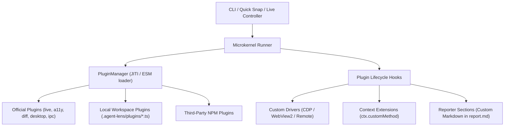

# 🔌 AgentLens Plugin Development Guide

AgentLens is built around a lightweight **Microkernel architecture**. The core runner handles process lifecycles, navigation, snapshot orchestration, and reporting. Specialized drivers, mock bridges, and developer tools are implemented as modular, composable **plugins**.

Whether you are a developer looking to integrate custom test pipelines or an **AI coding agent** that needs to solve a project-specific constraint on-the-fly, the AgentLens Plugin API provides complete extensibility.

---

## 📑 Table of Contents

1. [Architecture Overview](#-architecture-overview)
2. [The `AgentLensPlugin` Interface](#-the-agentlensplugin-interface)
3. [Lifecycle Hooks Explained](#-lifecycle-hooks-explained)
4. [Extending `TestContext` (`ctx`)](#-extending-testcontext-ctx)
5. [Custom Markdown Report Sections](#-custom-markdown-report-sections)
6. [Plugin Resolution & Loading Priority](#-plugin-resolution--loading-priority)
7. [Built-in Official Plugins](#-built-in-official-plugins)
8. [Writing a 1-File Plugin (Agent Guide)](#-writing-a-1-file-plugin-agent-guide)
9. [Concrete Examples](#-concrete-examples)
   - [Example 1: Custom Auth & LocalStorage Seeder](#example-1-custom-auth--localstorage-seeder)
   - [Example 2: Custom WebGL/Canvas Health Assertion](#example-2-custom-webglcanvas-health-assertion)
   - [Example 3: Performance & Core Web Vitals Monitor](#example-3-performance--core-web-vitals-monitor)

---

## 🏗️ Architecture Overview

The AgentLens runtime is structured into distinct layers:



Because AgentLens uses `jiti` internally, plugins can be written directly in **TypeScript (`.ts`) or JavaScript (`.js`) without needing any pre-compilation step!**

---

## 📐 The `AgentLensPlugin` Interface

Every plugin is an object implementing the `AgentLensPlugin` interface:

```typescript
import type { Page, BrowserContext, Browser } from 'playwright';
import type { TestContext, VisualScenario, ReportData } from 'agent-lens';

export interface DriverLaunchResult {
  page: Page;
  context: BrowserContext;
  browser?: Browser;
  stop?: () => Promise<void>;
}

export interface PluginHookContext {
  /** The currently running scenario configuration */
  scenario?: VisualScenario;
  /** Target execution mode ('preview' | 'desktop' | string) */
  targetMode: 'desktop' | 'preview' | string;
  /** Absolute path to the output artifacts directory for this run */
  artifactsDir: string;
  /** Active CLI arguments and configuration options */
  cliOptions?: Record<string, unknown>;
  /** Shared mutable state map accessible across all lifecycle hooks */
  state: Map<string, unknown>;
}

export interface AgentLensPlugin {
  /** Unique plugin identifier (e.g. 'auth-token', 'a11y-tree') */
  name: string;
  /** Semantic version string */
  version?: string;

  /** 1. Lifecycle hook: Runs before browsers or servers launch */
  setup?: (context: PluginHookContext) => Promise<void> | void;

  /** 2. Driver hook: Overrides default browser launch with a custom session */
  launchSession?: (
    options: { currentViewport: { width: number; height: number }; headed?: boolean },
    hookContext: PluginHookContext
  ) => Promise<DriverLaunchResult | undefined>;

  /** 3. Lifecycle hook: Triggered when the browser context is initialized */
  onContextCreated?: (context: BrowserContext, hookContext: PluginHookContext) => Promise<void> | void;

  /** 4. Lifecycle hook: Triggered when the test page is created */
  onPageCreated?: (page: Page, context: BrowserContext, hookContext: PluginHookContext) => Promise<void> | void;

  /** 5. Context extension: Injects custom methods/properties into `ctx` */
  extendContext?: (
    ctx: TestContext,
    page: Page,
    hookContext: PluginHookContext
  ) => Record<string, any> | Promise<Record<string, any>>;

  /** 6. Lifecycle hook: Triggered after test execution to enrich report.md */
  onAfterRun?: (reportData: ReportData, hookContext: PluginHookContext) => Promise<void> | void;

  /** 7. Cleanup hook: Guaranteed to execute in a `finally` block */
  teardown?: (hookContext: PluginHookContext) => Promise<void> | void;
}
```

Helper function for type safety:
```typescript
import { definePlugin } from 'agent-lens';

export default definePlugin({
  name: 'my-plugin',
  // ...
});
```

---

## 🔄 Lifecycle Hooks Explained

| Hook | When it runs | Primary Use Cases |
| :--- | :--- | :--- |
| `setup` | Before any dev server, browser, or scenario starts | Seeding test databases, creating temporary folders, registering shared state |
| `launchSession` | When the runner needs a browser/page session | Connecting to external remote CDP ports, launching compiled native `.exe` binaries, attaching to Electron apps |
| `onContextCreated` | Immediately after `browser.newContext()` is created | Calling `context.addInitScript()`, setting cookies, overriding geolocation, setting HTTP authorization headers |
| `onPageCreated` | When `context.newPage()` is ready | Setting custom user agents, binding CDP listeners, intercepting console/network streams |
| `extendContext` | Before scenario `run(ctx)` is invoked | Adding custom helper functions to `ctx` (e.g. `ctx.seedUser()`, `ctx.assertCanvas()`) |
| `onAfterRun` | After `run(ctx)` completes, before report writing | Calculating diffs, computing metrics, appending markdown sections to `reportData.customSections` |
| `teardown` | In the runner's `finally` block | Cleaning up background processes, restoring mocked files, removing DB records |

---

## 💉 Extending `TestContext` (`ctx`)

The `extendContext` hook allows you to expose domain-specific or framework-specific utilities directly to test authors:

```typescript
// .agent-lens/plugins/theme-tester.ts
import { definePlugin } from 'agent-lens';

export default definePlugin({
  name: 'theme-tester',
  extendContext: (_ctx, page) => {
    return {
      switchTheme: async (theme: 'dark' | 'light' | 'cyberpunk') => {
        await page.evaluate((t) => {
          document.documentElement.setAttribute('data-theme', t);
        }, theme);
        await page.waitForTimeout(150);
      }
    };
  }
});
```

In your scenario:
```typescript
import { defineVisualTest } from 'agent-lens';

export default defineVisualTest({
  id: 'theme-check',
  run: async (ctx) => {
    // Custom method injected by plugin!
    await (ctx as any).switchTheme('dark');
    await ctx.capture('01_dark_theme');

    await (ctx as any).switchTheme('cyberpunk');
    await ctx.capture('02_cyberpunk_theme');
  }
});
```

---

## 📊 Custom Markdown Report Sections

Plugins can append custom sections directly to `reportData.customSections`. These are automatically rendered by the `VisualReporter` into both `artifacts/<timestamp>/report.md` and `artifacts/latest/report.md`.

```typescript
onAfterRun: (reportData, hookContext) => {
  if (!reportData.customSections) return;

  reportData.customSections.push({
    title: '🚀 Performance Metrics',
    content: `| Metric | Value | Status |
| :--- | :--- | :-: |
| First Contentful Paint | 142ms | 🟢 Pass |
| Largest Contentful Paint | 410ms | 🟢 Pass |
| Cumulative Layout Shift | 0.002 | 🟢 Pass |`
  });
}
```

---

## 🔍 Plugin Resolution & Loading Priority

AgentLens discovers and registers plugins in the following order:

1. **CLI Flags**: `--plugin=name1,name2` or `--plugins=name1,name2`
2. **Configuration File**: `plugins: ["name1"]` in `agent-lens.json` or `package.json`
3. **Scenario Definition**: `plugins: ['name1', inlinePluginObject]` in scenario file
4. **Local Project Conventions** (searched in order):
   - `.agent-lens/plugins/<name>.ts`
   - `.agent-lens/plugins/<name>.js`
   - `.agent-lens/plugins/<name>/index.ts`
   - `.agent-lens/plugins/<name>/index.js`
   - `plugins/<name>.ts`
   - `plugins/<name>.js`
   - `plugins/<name>/index.ts`
   - `plugins/<name>/index.js`
5. **Direct Relative/Absolute Paths**: e.g. `--plugin=./scripts/my-plugin.ts`
6. **Built-in Plugins**: `desktop-webview2`, `mock-ipc`, `live-controller`, `a11y-tree`, `visual-diff`
7. **NPM Modules**: Resolves installed packages from `node_modules` (e.g. `@agent-lens/plugin-lighthouse`)

---

## 📦 Built-in Official Plugins

AgentLens ships with 5 core plugins out of the box:

### 1. `live-controller`
- **Purpose**: Provides persistent, interactive background browser sessions for rapid iteration without restarts.
- **Commands**:
  - `npx agent-lens live start --url=http://localhost:5173`
  - `npx agent-lens live click 450 120` (Vision coordinate clicks)
  - `npx agent-lens live click "button.submit"` (CSS selector clicks)
  - `npx agent-lens live type "input[name=email]" "user@example.com"`
  - `npx agent-lens live snap [name] [--full]` (Capture current state or full scrollable page)
  - `npx agent-lens live stop`
- **Context Extensions**: `ctx.clickCoords(x, y)`, `ctx.dragAndDrop(fromX, fromY, toX, toY)`, `ctx.scrollPercent(pct)`, `ctx.snapLive(options)`.

### 2. `a11y-tree`
- **Purpose**: Extracts a clean, semantic accessibility hierarchy from the live DOM (roles, accessible names, values, focus states).
- **Benefits**: Allows text-only LLMs (or lightweight models without vision) to "read" the exact UI layout and verify interactive state.
- **Outputs**: Generates `artifacts/latest/a11y-tree.md` and appends an accessibility section to `report.md`.
- **Context Extensions**: `await ctx.dumpAccessibilityTree({ selector?: string, compact?: boolean })`.

### 3. `visual-diff`
- **Purpose**: Performs pixel-by-pixel visual regression testing using `pixelmatch` and `pngjs`.
- **Outputs**: Generates `*_diff.png` highlighting changed pixels in red/yellow, reports exact changed pixel counts and regression percentages, and attaches a comparison table to `report.md`.
- **Context Extensions**:
  - `await ctx.compareSnapshots(currentPath, baselinePath, options?)`
  - `await ctx.captureAndCompare(name, baselinePath, captureOptions?, diffOptions?)`

### 4. `desktop-webview2`
- **Purpose**: Native Windows executable testing (`.exe` using WebView2, Electron, or Photino).
- **Features**: Auto-launches target `.exe` with remote debugging flags, connects via CDP (`localhost:9222`), handles graceful process termination via `treeKill`, and captures startup crash logs.
- **Activation**: Auto-loaded whenever `--mode=desktop` or `--exe=path/to/app.exe` is passed.

### 5. `mock-ipc`
- **Purpose**: Mocks desktop hybrid bridge calls (`window.__mockIpc` and `window.external.sendMessage`).
- **Features**: Auto-loads base mocks from `scenarios/mocks.ts` and allows runtime overrides via `await ctx.setMockIpc('ACTION', payload)`.
- **Activation**: Auto-loaded whenever `mocks.ts` exists or a scenario specifies `mockIpc: [...]`.

---

## 🤖 Writing a 1-File Plugin (Agent Guide)

### When should an AI Agent create a plugin?
When an agent faces a project requirement that cannot be solved by standard CLI flags or standard DSL:
- The app requires a specific auth token in `localStorage` or `sessionStorage` before mounting.
- The app requires mock WebSockets or Server-Sent Events (SSE).
- The app requires custom Canvas/WebGL assertions or pixel color checks.
- The project has a custom database or SQLite file that needs seeding before the dev server checks.

### Step-by-Step Agent Recipe:
1. Create a single file inside the project at `.agent-lens/plugins/<plugin-name>.ts`.
2. Implement `definePlugin({ name: '<plugin-name>', ... })` and export it as `default`.
3. If you need helper methods in your scenario, return them from `extendContext`.
4. Run your verification:
   ```bash
   npx agent-lens snap --plugin=<plugin-name> --url=http://localhost:5173
   # OR
   npx agent-lens --scenario=my-test --plugin=<plugin-name>
   ```
5. Inspect `artifacts/latest/report.md` to verify results.

---

## 💡 Concrete Examples

### Example 1: Custom Auth & LocalStorage Seeder

Suppose an app immediately redirects unauthenticated users to `/login`. You can create a plugin to inject a mock JWT into `localStorage` before any scripts run:

```typescript
// .agent-lens/plugins/mock-auth.ts
import { definePlugin } from 'agent-lens';

export default definePlugin({
  name: 'mock-auth',
  version: '1.0.0',

  onContextCreated: async (context) => {
    // Inject mock session into localStorage before React mounts
    await context.addInitScript(() => {
      window.localStorage.setItem('auth_token', 'mock-agent-jwt-token-xyz');
      window.localStorage.setItem('user_profile', JSON.stringify({
        id: 99,
        name: 'Autonomous Agent',
        role: 'SUPERADMIN',
        permissions: ['read', 'write', 'delete']
      }));
    });
  }
});
```

Run:
```bash
npx agent-lens snap --plugin=mock-auth --url=http://localhost:5173/dashboard
```

---

### Example 2: Custom WebGL/Canvas Health Assertion

Verify that a 3D canvas is actually drawing shapes and not just rendering a blank transparent canvas:

```typescript
// .agent-lens/plugins/canvas-validator.ts
import { definePlugin } from 'agent-lens';

export default definePlugin({
  name: 'canvas-validator',
  extendContext: (_ctx, page) => {
    return {
      assertCanvasHasPixels: async (selector = 'canvas') => {
        const hasContent = await page.evaluate((sel) => {
          const canvas = document.querySelector(sel) as HTMLCanvasElement;
          if (!canvas) return false;
          const ctx = canvas.getContext('2d') || canvas.getContext('webgl2') || canvas.getContext('webgl');
          if (!ctx) return false;

          // Quick probe of center pixel
          const probe = document.createElement('canvas');
          probe.width = 10;
          probe.height = 10;
          const pctx = probe.getContext('2d');
          if (!pctx) return false;
          pctx.drawImage(canvas, 0, 0, 10, 10);
          const imgData = pctx.getImageData(0, 0, 10, 10).data;
          // Check if any non-zero alpha pixel exists
          for (let i = 3; i < imgData.length; i += 4) {
            if (imgData[i] > 0) return true;
          }
          return false;
        }, selector);

        if (!hasContent) {
          throw new Error(`Canvas "${selector}" is completely blank or transparent!`);
        }
      }
    };
  }
});
```

---

### Example 3: Performance & Core Web Vitals Monitor

Capture page performance metrics and inject an audit card directly into the final `report.md`:

```typescript
// .agent-lens/plugins/web-vitals.ts
import { definePlugin } from 'agent-lens';

const PERF_STATE_KEY = 'perf_timings';

export default definePlugin({
  name: 'web-vitals',

  onPageCreated: (page, _context, hookContext) => {
    page.on('load', async () => {
      const timings = await page.evaluate(() => {
        const perf = window.performance;
        const timing = perf.getEntriesByType('navigation')[0] as PerformanceNavigationTiming;
        if (!timing) return null;
        return {
          domInteractive: Math.round(timing.domInteractive),
          domContentLoaded: Math.round(timing.domContentLoadedEventEnd),
          loadEvent: Math.round(timing.loadEventEnd),
          transferSizeKb: Math.round(timing.transferSize / 1024)
        };
      });

      if (timings) {
        hookContext.state.set(PERF_STATE_KEY, timings);
      }
    });
  },

  onAfterRun: (reportData, hookContext) => {
    const timings = hookContext.state.get(PERF_STATE_KEY) as Record<string, number> | undefined;
    if (!timings || !reportData.customSections) return;

    reportData.customSections.push({
      title: '⚡ Web Vitals & Load Performance',
      content: `| Metric | Time / Size | Status |
| :--- | :--- | :-: |
| DOM Interactive | ${timings.domInteractive} ms | ${timings.domInteractive < 1000 ? '🟢 Fast' : '🟡 Slow'} |
| DOM Content Loaded | ${timings.domContentLoaded} ms | ${timings.domContentLoaded < 1500 ? '🟢 Fast' : '🟡 Slow'} |
| Full Load Complete | ${timings.loadEvent} ms | ${timings.loadEvent < 2500 ? '🟢 Fast' : '🟡 Slow'} |
| Total Transferred | ${timings.transferSizeKb} KB | 📦 Network |`
    });
  }
});
```
