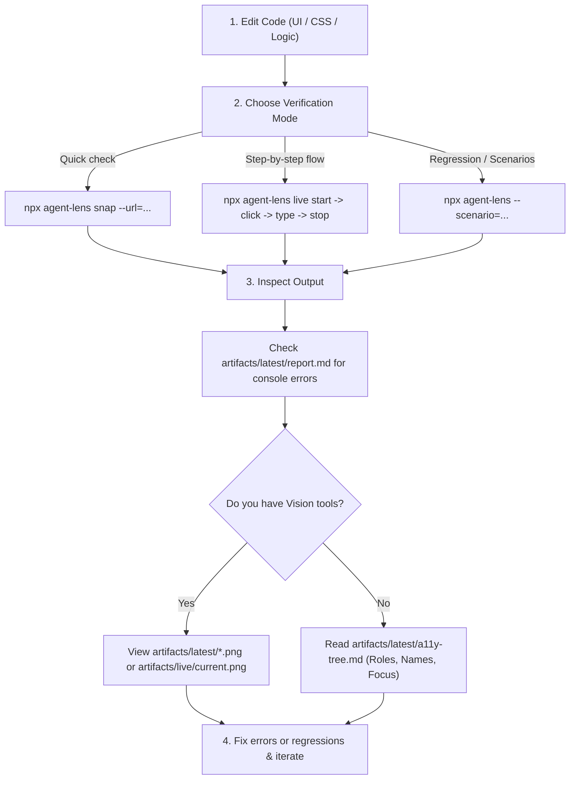

# 👁️ AgentLens (Microkernel Agentic UI Platform)

**AgentLens** gives AI coding agents **eyes** and **hands** to test and verify user interfaces before reporting back to humans.

Instead of writing frontend code and blindly guessing if it looks right or works properly, AgentLens allows you to:
1. Capture multi-viewport screenshots of your running app with one-shot `snap`.
2. Inspect entire scrollable pages with `--full`.
3. Drive interactive step-by-step browser sessions via persistent `live` commands (`click`, `type`, `snap`) without cold-start browser restarts.
4. "Read" the exact semantic hierarchy and interactive states using the `a11y-tree` plugin (essential for text-only LLMs or accessibility audits).
5. Detect pixel-level visual regressions using the `visual-diff` plugin.
6. Intercept silent JavaScript runtime errors, unhandled promise rejections, and missing assets.
7. Author your own 1-file plugins on-the-fly in `.agent-lens/plugins/` to solve novel project constraints.

---

## ⚡ 3 Ways for an Agent to Interact

### 1. Instant One-Shot Verification (`snap`)
Ideal for 90% of tasks when you just modified a page, component, or responsive layout:
```bash
# Verify live dev server across desktop & mobile viewports:
npx agent-lens snap --url=http://localhost:5173

# Capture entire scrollable page height:
npx agent-lens snap --url=http://localhost:5173 --full

# Auto-start dev server in a monorepo (e.g. Frontend/), snap, and auto-terminate:
npx agent-lens snap --start="npm run dev" --start-cwd=./Frontend

# Focus strictly on one component:
npx agent-lens snap --url=http://localhost:5173/settings --selector=".pricing-card"

# Extract semantic accessibility tree during snap:
npx agent-lens snap --url=http://localhost:5173 --plugin=a11y-tree
```

---

### 2. Interactive Live Controller Loop (`live`)
Ideal for multi-step flows, debugging interactions, or iterative visual tuning without restarting the browser on each action:

```bash
# Step 1: Start background session (launches browser on CDP port 9223)
npx agent-lens live start --url=http://localhost:5173

# Step 2: Click via Vision physical coordinates or CSS selector
npx agent-lens live click 450 180
npx agent-lens live click "button.open-modal"

# Step 3: Fill inputs
npx agent-lens live type "input[name='email']" "agent@example.com"

# Step 4: Capture current screen or full scrollable page
npx agent-lens live snap step_02 --full

# Step 5: Stop session when done
npx agent-lens live stop
```
> 💡 *Every live action automatically updates `artifacts/live/current.png` in ~50ms, allowing instant visual feedback.*

---

### 3. Scripted Scenarios (`scenarios/*.scenario.ts`)
For reproducible test suites, state mocking, animations, and regression diffing:
```bash
npx agent-lens --scenario=checkout-flow --url=http://localhost:5173
```

---

## 🧭 The Agent Workflow



1. **Check Logs First**: Always inspect `artifacts/latest/report.md`. If there are any **Console Errors**, fix the JavaScript / React exceptions first.
2. **If You Have Vision (`view_image`)**: Inspect the latest generated PNGs:
   - `artifacts/latest/01_quick_snap_desktop.png`
   - `artifacts/latest/02_quick_snap_mobile.png`
   - Look for clipped text, unexpected wrapping, broken flex/grid columns, or overlay bugs.
3. **If You Are Text-Only**: Run with `--plugin=a11y-tree` and inspect:
   - `artifacts/latest/a11y-tree.md`
   - Verify that buttons, form inputs, headings, and dialogs are rendered with expected text and states.

---

## 🔌 Built-In Plugins & Extensibility

AgentLens is built around a lightweight **Microkernel architecture**. The core engine is decoupled from drivers, mocks, and tooling plugins:

| Plugin | Primary Purpose | How to Activate |
| :--- | :--- | :--- |
| `live-controller` | Background CDP session for coordinate clicks, drag-and-drop, interactive CLI loop | CLI `live` command or `--plugin=live-controller` |
| `a11y-tree` | Semantic accessibility tree extraction into clean Markdown | `--plugin=a11y-tree` or in scenario `plugins: ['a11y-tree']` |
| `visual-diff` | Pixel-by-pixel regression diffing with `pixelmatch` | `--plugin=visual-diff` or in scenario `plugins: ['visual-diff']` |
| `desktop-webview2` | Windows native `.exe` testing via CDP remote port | Auto-activated on `--mode=desktop` or `--exe=path/to/app.exe` |
| `mock-ipc` | Desktop IPC bridge mocking (`window.__mockIpc`) | Auto-activated if `scenarios/mocks.ts` exists |

### 🛠️ Writing Custom Plugins On-The-Fly
If you encounter a project constraint that cannot be handled by default options (e.g. custom authentication headers, pre-populating `localStorage`, WebSocket mocking, or database seeding), **write a 1-file plugin**:

1. Create `.agent-lens/plugins/<name>.ts`.
2. Export `definePlugin({ name: '<name>', ... })` as `default`.
3. Use lifecycle hooks (`onContextCreated`, `extendContext`, `onAfterRun`, `teardown`).
4. Execute via `npx agent-lens snap --plugin=<name>`.

*Full instructions & examples:* [Plugin Development Reference](references/plugin-development.md) and [docs/plugins.md](file:///E:/github/agent-lens/docs/plugins.md).

---

## ⚠️ Agent Best Practices & Pitfalls to Avoid

### 1. Avoid Localized Text in Selectors (Localization Pitfall)
❌ **Never write:**
```typescript
await ctx.type('input[placeholder*="Search"]', 'text'); // Fails if language is Ukrainian "Пошук"!
await ctx.click('button:has-text("Save")');            // Fails on non-English UI!
```
✅ **Always use semantic attributes, test IDs, or structural CSS:**
```typescript
await ctx.type('input[type="search"]', 'text');
await ctx.type('input[name="query"]', 'text');
await ctx.click('button[type="submit"]');
await ctx.click('[data-testid="save-button"]');
```

### 2. Base Mocks in `scenarios/mocks.ts` (Prevent Root Crashes)
When your app mounts, root components (Navbar, AuthContext, Layout) often query base endpoints (e.g. `GET_USER`, `GET_SETTINGS`, `GET_ACCOUNTS`). If your scenario only mocks one sub-action, unmocked root actions may return empty and crash the app with `Cannot read properties of null (reading 'length')`.
- Place common base mocks in `scenarios/mocks.ts`.
- AgentLens automatically merges `scenarios/mocks.ts` with your scenario's specific `mockIpc: [...]` overrides!

### 3. Monorepos & Subdirectories (`--start-cwd`)
If your frontend lives in a subfolder like `Frontend/` or `client/`:
- Pass `--start-cwd=./Frontend` (or configure `"startCwd": "./Frontend"` in `agent-lens.json`).
- AgentLens automatically auto-detects `Frontend/`, `client/`, or `web/` if root `package.json` lacks a `dev` script.

### 4. Preventing Artifact Folder Bloat
To keep the workspace tidy across multiple test iterations, use:
```bash
npx agent-lens snap --clean-artifacts
```
Or always inspect the single persistent pointer:
`artifacts/latest/report.md`

---

## 💻 CLI Flags & Options

```bash
npx agent-lens [command] [options]
```

### Commands:
- `snap`: Instant one-shot snapshot & console check of a URL or static build.
- `live`: Interactive session (`start`, `click`, `type`, `snap`, `stop`).
- `init`: Generate starter template in `scenarios/template.scenario.ts` and `scenarios/mocks.ts`.
- *(default)*: Runs matching scenarios from `scenarios/`.

### Options:
| Flag | Description | Default |
| :--- | :--- | :--- |
| `--url=<url>` | Target URL to test (e.g. `http://localhost:5173`) | *Auto-detected* |
| `--start="<cmd>"` | Auto-launch dev server / backend before test | *(none)* |
| `--start-cwd=<path>` | Directory to run `--start` in (e.g. `--start-cwd=./Frontend`) | *Auto-detected* |
| `--clean-artifacts` | Purge older test runs in `artifacts/` | `false` |
| `--full` | Capture full scrollable page height instead of viewport | `false` |
| `--selector=<css>` | Focus and resize-to-fit a specific component | *(none)* |
| `--viewports=<list>` | Viewports to capture (`desktop,mobile,tablet` or `1200x800`) | `desktop,mobile` |
| `--wait=<ms>` | Wait time after page load before taking snapshots | `1000` |
| `--plugin=<list>` | Comma-separated plugins to load (e.g. `--plugin=a11y-tree,visual-diff`) | *(none)* |
| `--scenario=<id>` | Name or prefix of scenario file to run | *(none)* |
| `--all` | Run all discovered scenarios | `false` |
| `--mode=preview\|desktop` | Engine: `preview` (Web / Live URL) or `desktop` (native .exe) | `preview` |
| `--exe=<path>` | Path to compiled desktop executable for desktop mode | *(none)* |
| `--port=<port>` | CDP remote debugging port for desktop mode | `9222` |
| `--build[=<cmd>]` | Build command to run before testing | `npm run build` |
| `--clean=<paths>` | Comma-separated paths to purge on exit | *(none)* |
| `--folder=<path>` | Folder to store report & screenshots (also `--outDir`) | `artifacts` |
| `--headed` | Open visible browser window | `false` |
| `--detach` | Do not close browser or app on finish | `false` |

---

## 🛠️ DSL API Reference (`scenarios/*.scenario.ts`)

```typescript
import { defineVisualTest, VIEWPORT_PRESETS, type TestContext } from 'agent-lens';

export default defineVisualTest({
  id: 'my-feature-check',
  title: 'Feature Verification',
  route: '/dashboard',
  viewports: [VIEWPORT_PRESETS.DEFAULT, VIEWPORT_PRESETS.MIN_SUPPORTED],

  // Load plugins for this scenario:
  plugins: ['a11y-tree', 'visual-diff'],

  // HTTP REST / GraphQL Network Mocks (Vite / Next.js / Web SPA)
  mockRoutes: [
    { url: '**/api/v1/user', body: { id: 1, name: 'Agent', role: 'admin' } },
    { url: '**/api/v1/stats', body: { total: 42, active: 10 } }
  ],

  // Optional Hybrid / IPC mocks
  mockIpc: [
    { action: 'GET_PREFS', data: { theme: 'dark' } }
  ],
  
  // Lifecycle Setup: prepare temporary state or mock folders
  setup: async () => {},

  // Test Body: interact and capture
  run: async (ctx) => {},

  // Lifecycle Teardown: ALWAYS executes, guaranteed cleanup
  teardown: async () => {}
});
```

### Available `ctx` Methods:

#### 📸 Capturing
- `await ctx.capture('01_name', options?)`: Capture snapshot (supports `{ fullPage: true, selector: '...' }`).
- `await ctx.captureBurst('02_anim', { durationMs: 300, intervalMs: 50, selector? })`: Capture animation frames.

#### 📐 Viewport Control
- `await ctx.setPreset(VIEWPORT_PRESETS.DEFAULT)`: Standard desktop (1200x800).
- `await ctx.setPreset(VIEWPORT_PRESETS.MIN_SUPPORTED)`: Compact viewport (1024x768).
- `await ctx.setPreset(VIEWPORT_PRESETS.WIDE)`: Widescreen (1600x900).
- `await ctx.resize(width, height)`: Custom dimensions.
- `await ctx.resizeToFit('selector', padding?)`: Dynamically resize viewport to wrap an element tightly.

#### 🖱️ Interactions
- `await ctx.click('selector')` / `await ctx.rightClick('selector')`
- `await ctx.type('selector', 'text')`
- `await ctx.selectOption('selector', 'value')`
- `await ctx.hover('selector')`
- `await ctx.scroll('selector', deltaY)`

#### 🕒 Waiting & Assertions
- `await ctx.wait(ms)`
- `await ctx.waitForSelector('selector', timeoutMs?)`
- `const text = await ctx.readText('selector')`
- `const pageText = await ctx.getPageText()`
- `const isVisible = await ctx.isVisible('selector')`
- `const count = await ctx.getElementCount('selector')`

#### 🐛 Console & Logs
- `ctx.log('Message')`: Writes custom log entry into the final markdown report.
- `ctx.getConsoleErrors()`: Array of caught errors with stack traces.
- `ctx.getConsoleWarnings()`: Array of caught warnings.

#### 🌐 Network Route & Mock IPC
- `await ctx.setMockRoute('**/api/users', payload, options?)`: Dynamically intercepts HTTP/REST API endpoints.
- `await ctx.setMockIpc('ACTION_NAME', payload, { type: 'SUCCESS' | 'ERROR', delayMs?: number })`: Dynamically alters mock data for hybrid IPC bridges.

#### 🔌 Plugin Extensions (When Plugins Are Loaded)
- **live-controller**:
  - `await ctx.clickCoords(x, y, options?)`
  - `await ctx.dragAndDrop(fromX, fromY, toX, toY, steps?)`
  - `await ctx.scrollPercent(percent)`
  - `await ctx.snapLive(options?)`
- **a11y-tree**:
  - `await ctx.dumpAccessibilityTree({ selector?: string, compact?: boolean })`
- **visual-diff**:
  - `await ctx.compareSnapshots(currentPath, baselinePath, options?)`
  - `await ctx.captureAndCompare(name, baselinePath, captureOptions?, diffOptions?)`

---

## 📚 Complete Walkthroughs & Examples

Check the dedicated example guides in `examples/`:
1. [Instant Verification (`snap`)](examples/01-instant-verification-snap.md) — One-shot snapshotting without writing test files.
2. [Live Dev Server Workflow](examples/02-dev-server-live-testing.md) — Testing active Vite/Next.js servers with `--start` or `--url`.
3. [Component Isolation & Burst Animations](examples/03-component-isolation-and-animations.md) — Inspecting isolated components and CSS transitions.
4. [Native Desktop App Testing](examples/04-desktop-native-testing.md) — Testing compiled `.exe` binaries with CDP and crash diagnostics.
5. [Clean Teardown & Sandboxing](examples/05-clean-teardown-and-sandboxing.md) — Guaranteeing zero leftover test data using `teardown()` and `--clean`.
6. [State Testing with Mock IPC](examples/06-state-testing-with-mock-ipc.md) — Testing empty states, errors, and data tables.
7. [Live Controller Interactive Loop](examples/07-live-controller-interactive-loop.md) — Low-latency real-time control via CLI commands.
8. [Semantic Accessibility Tree Inspection](examples/08-accessibility-semantic-inspection.md) — Extracting UI hierarchies for text LLMs.
9. [Visual Regression & Pixel Diffing](examples/09-visual-regression-and-pixel-diffing.md) — Automated pixelmatch difference masks.
10. [Authoring Custom Agent Plugins](examples/10-authoring-custom-agent-plugins.md) — Writing 1-file plugins on-the-fly.
